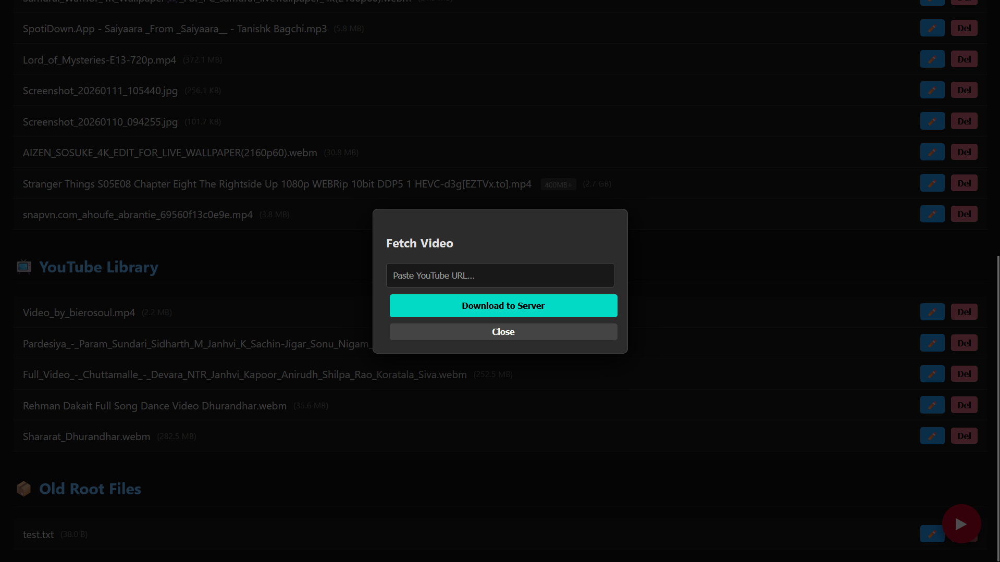

<div align="center">

# ☁️ PyCloud v8.6  
### System-Powered Personal Cloud & Media Center

A lightweight, self-hosted **private cloud and media server** built entirely in **Python**.

**No frameworks. No database. One Python script.**


<br>


</div>

---

## 🚀 Overview

**PyCloud** is a minimal yet powerful **personal cloud, file manager, media center, and background task engine** designed for:

- VPS servers  
- Raspberry Pi  
- Home labs  
- Local Linux machines  

It runs as a **single Python process**, directly interacting with the system.

---

## ✨ Key Features

### 🖥 Interactive Dashboard
- **Live System Monitor** — CPU, RAM, and disk usage in real time
- **Responsive UI** — Dark mode with CSS3 animations
- **Instant Search** — Client-side filtering for thousands of files

### ⚡ Background Task Manager
- **Asynchronous Processing** — No server freeze during heavy tasks
- **Live Task Console** — View logs, cancel or retry tasks
- **Queue System** — Sequential `yt-dlp` downloads

### 📁 File Management
- **Smart Uploads** — Drag & drop with progress bar and cancel
- **Rename** — Rename files directly in-browser
- **Smart Delete**
  - Files: instant removal
  - Folders: **Nuclear Delete** (`shutil.rmtree`)
- **Auto Categorization**
  - Manual Uploads
  - YouTube Library
  - Old Root Files

⚠️ Folder deletion is immediate and irreversible.

### 🎬 Media Streaming
- **Cinema Mode** — MP4 / MKV / WebM
- **Smart Subtitles** — Auto-load `.vtt`
- **Large File Handling** — Files >400MB use download mode

### 🔗 Integrations & Security
- **YouTube / Social Downloader** — Powered by `yt-dlp`
- **Basic Authentication**
- **Hidden System Files**

---

## 🛠 Setup

### Prerequisites

```bash
sudo apt update
sudo apt install python3 python3-ffmpeg
```

FFmpeg is required for merging YouTube audio + video.

---

### 📥 Download `secure_server.py`

```bash
git clone https://github.com/Gaurav5189/PyCloud-Server.git
cd PyCloud-Server
```

Or:

```bash
wget https://raw.githubusercontent.com/Gaurav5189/PyCloud-Server/main/secure_server.py
```

---

### Download yt-dlp

```bash
wget https://github.com/yt-dlp/yt-dlp/releases/latest/download/yt-dlp_linux
mv yt-dlp_linux yt-dlp
chmod +x yt-dlp
```

---

## ⚙️ Configuration

Edit `secure_server.py`:

```python
PORT = 8080
USERNAME = "admin"
PASSWORD = "CHANGE_THIS_PASSWORD"
ROOT_DIR = "/your/path/here"
```

Recommended: use an **empty directory** for `ROOT_DIR` for a clean start. You can add files later.

---

## ▶️ Run the Server

```bash
nohup python3 secure_server.py &
```

---

## 🌐 Accessing PyCloud

Open your browser:

```
http://<your_ip>:8080
```

Examples:
- http://localhost:8080
- http://192.168.1.100:8080
- http://your_public_ip:8080

---

## � Important Commands

### 🟢 Server Management
- `nohup python3 secure_server.py &` **Start Server**: Runs your Python script in the background so it stays alive even if you close the window.
- `pkill -f secure_server.py` **Stop Server**: Forcefully stops (kills) the Python server process instantly.

### 🛠️ Debugging & Troubleshooting
- `cat nohup.out` **Read Logs**: Prints the server's output log to the screen (useful for seeing errors).
- `lsof -i :8080` **Check Port**: Shows exactly which program is holding onto Port 8080.
- `ps aux | grep secure_server.py` **Find PID**: Lists running processes to see if your server is active and what its Process ID (PID) is.

---

## �🖼 Screenshots

| Dashboard | Media download |
|:---:|:---:|
|  |  |

---

## 📜 License

Open Source. Free to modify and use.

<div align="center">

**Your files. Your server. Your control.**

</div>
